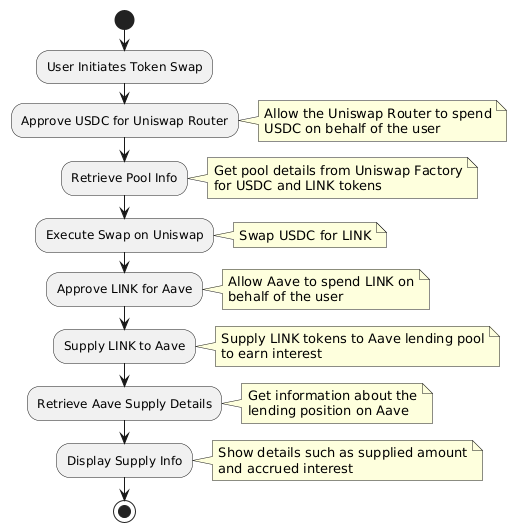

# DeFi Interaction Script

## Overview

This script is designed to demonstrate the integration and composability of various decentralized finance (DeFi) protocols, specifically Uniswap and Aave. The script performs the following operations:

1. **Token Swap on Uniswap**: 
   - The user initiates a token swap by approving the Uniswap Router to spend a specific amount of USDC on their behalf.
   - The script retrieves the necessary pool information from the Uniswap Factory contract.
   - The Swap Router then executes the swap, converting USDC to LINK.

2. **Supplying Tokens to Aave**:
   - Once the swap is completed, the script approves Aave to spend the swapped LINK tokens.
   - The LINK tokens are then supplied to the Aave lending pool, enabling the user to start earning interest on their LINK holdings.

3. **Retrieving Supply Details**:
   - The script retrieves information about the user's lending position on Aave, including the supplied amount and any accrued interest.

This workflow showcases how users can not only swap tokens using a decentralized exchange like Uniswap but also put their assets to work by earning additional yields on lending platforms such as Aave.

## Diagram Illustration

Below is a diagram illustrating the sequence of steps and interactions between the protocols:

# Code Explanation

## Introduction

This document provides a detailed explanation of the DeFi script's codebase. The script interacts with Uniswap and Aave protocols to perform token swaps and supply tokens for interest-earning opportunities. Each function in the script is designed to handle specific tasks in this workflow.

## Key Functions and Logic

### 1. `approveToken`

**Purpose**: To approve a specific amount of a token for spending by another smart contract (in this case, the Uniswap Swap Router or Aave).

**Parameters**:
- `tokenAddress`: The address of the token contract to be approved.
- `tokenABI`: The ABI JSON of the token contract.
- `amount`: The amount of tokens to approve.
- `wallet`: The wallet instance to sign the transaction.

**Logic**:
- Initializes a contract instance for the token using the provided address, ABI, and wallet.
- Converts the specified amount into the correct units based on the token decimals.
- Prepares and sends the approval transaction to the blockchain.
- Logs the transaction hash and waits for confirmation.

### 2. `getPoolInfo`

**Purpose**: To retrieve information about a specific liquidity pool from the Uniswap Factory contract.

**Parameters**:
- `factoryContract`: The factory contract instance used to get the pool address.
- `tokenIn`: The input token for the pool (e.g., USDC).
- `tokenOut`: The output token for the pool (e.g., LINK).

**Logic**:
- Calls the `getPool` method on the factory contract to retrieve the pool address using the input and output token addresses and a fee tier.
- Initializes a contract instance for the pool using the retrieved address.
- Retrieves and returns the pool contract, the token addresses, and the fee tier.

### 3. `prepareSwapParams`

**Purpose**: To prepare the parameters required for executing a token swap on a Uniswap V3 pool contract.

**Parameters**:
- `poolContract`: The pool contract instance.
- `signer`: The wallet instance that will sign the transaction and receive the swapped tokens.
- `amountIn`: The amount of input tokens (e.g., USDC) to be swapped.

**Logic**:
- Constructs and returns an object containing the necessary parameters for the swap, including token addresses, fee, recipient, and amounts.

### 4. `executeSwap`

**Purpose**: To execute a token swap on the Uniswap V3 Swap Router using the provided swap parameters.

**Parameters**:
- `swapRouter`: The Swap Router contract instance.
- `params`: The swap parameters object.
- `signer`: The wallet instance that will sign and send the transaction.

**Logic**:
- Calls the `exactInputSingle.populateTransaction` on the swapRouter with the provided parameters to create a swap transaction.
- Sends the transaction and waits for it to be included in a block.
- Logs the transaction receipt for verification.

### 5. `main`

**Purpose**: To orchestrate the entire process of swapping USDC for LINK on Uniswap and then supplying LINK to Aave.

**Parameters**:
- `swapAmount`: The amount of USDC to be swapped for LINK.

**Logic**:
- Converts the swap amount into the correct units.
- Calls `approveToken` to approve the Swap Router to use the specified amount of USDC.
- Calls `getPoolInfo` to retrieve the required pool contract information.
- Prepares the swap parameters by calling `prepareSwapParams`.
- Creates the Swap Router contract instance and executes the swap by calling `executeSwap`.

## Conclusion

This script exemplifies how to integrate and interact with different DeFi protocols using a combination of smart contract calls and Ethers.js. By breaking down the process into modular functions, it provides a clear structure and flexibility to extend or modify the interactions as needed.

